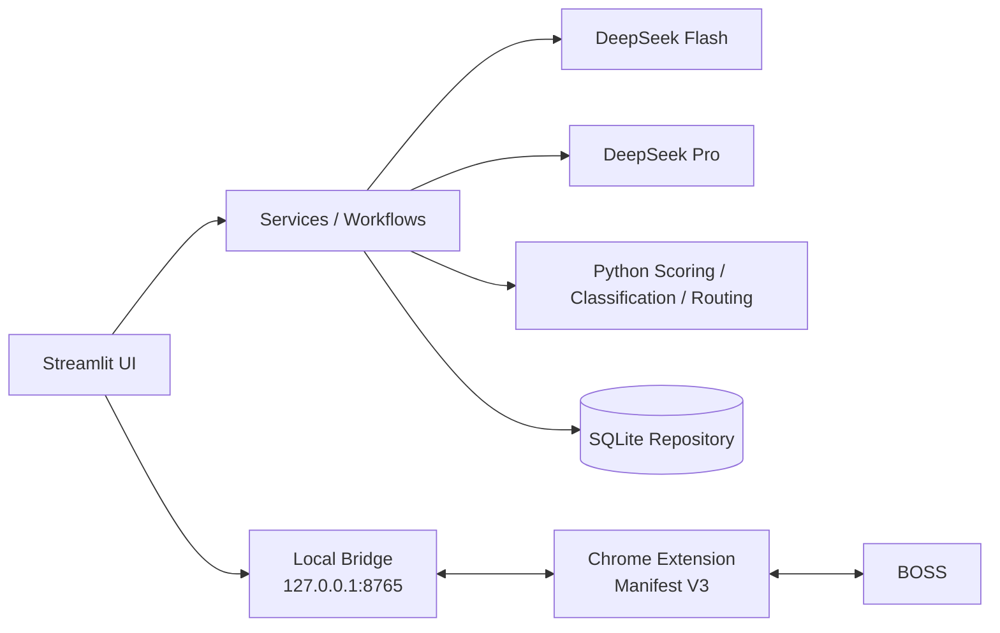

# JobPilot


**AI-powered job search copilot for resume matching, batch job screening and assisted recruiter outreach.**

JobPilot 是一个面向真实求职工作流的 AI 求职辅助 Agent。它把简历理解、岗位筛选、深度匹配、用户确认后的招聘方沟通和求职进度管理整合在一个本地优先的 Web 应用中。

## Overview

求职者通常需要反复阅读 JD、判断匹配度、比较多个岗位、手动建立沟通并记录进度。JobPilot 将这些重复步骤组织成一个可追踪、可验证的工作流，同时把最终评分、分类与安全边界保留在确定性的 Python 逻辑中。

当前 v1.0 聚焦 BOSS 直聘岗位采集与初始沟通。BOSS 自动化仅用于对用户明确选择、再次确认的岗位发起沟通，不会自动回复招聘方或自动发送简历。

## Key Features

- **Resume Intelligence**：本地解析 PDF/DOCX，并通过结构化输出生成候选人画像。
- **JD Intelligence**：提取技能、职责、经验、学历和硬性要求。
- **Fast Batch Screening**：通过本地预筛、并发 Flash 快筛和受控 Pro Gate 比较多个岗位。
- **Deep Semantic Matching**：识别匹配技能、部分匹配、缺口与简历证据。
- **Dual-model Routing**：Flash 处理高频低成本任务，Pro 处理边界岗位与深度语义判断。
- **BOSS Job Capture Extension**：从用户主动打开的 BOSS 页面连续采集岗位与 JD。
- **Assisted Batch Contact**：仅在用户确认后，通过本地 Bridge 辅助发起初始沟通。
- **Application Tracking**：使用 SQLite 管理收藏、沟通、投递、面试、Offer 和结束状态。

## Product Workflow


## Architecture



- **Flash**：简历与 JD 结构化、批量快速判断及受控 JSON repair。
- **Pro**：边界岗位、深度语义匹配与有证据约束的分析。
- **Python**：最终 scoring、classification、routing、缓存指纹和业务安全校验。LLM 不直接决定最终分数。
- **Local Bridge**：仅监听 `127.0.0.1`，通过短期连接令牌连接 Streamlit 进程与 Chrome Extension。

## Performance Optimization

早期真实用户流程处理 5 个岗位约需 60 秒。经过以下优化，一次具有代表性的 provider benchmark 中，5 个岗位约需 3.1 秒，首个结果约 1.9 秒：

- compact candidate summary
- deterministic JD trimming
- concurrent Flash requests
- tighter Pro Gate
- fingerprint cache reuse
- duplicate parsing and provider-call elimination

这些数字是特定输入、网络与 provider 状态下的代表性测量，不代表所有环境都能稳定达到相同耗时。

## Tech Stack

- Python 3.10+
- Streamlit 1.63
- DeepSeek API / OpenAI-compatible SDK
- Pydantic
- SQLite
- PyMuPDF
- python-docx
- Chrome Extension Manifest V3 / JavaScript
- Playwright
- `ThreadPoolExecutor`
- pytest

## Project Structure

```text
JobPilot/
├── app.py                  # Streamlit entry point
├── extension/              # Manifest V3 BOSS capture/contact extension
├── scripts/                # Demo seed and explicit benchmarks
├── src/jobpilot/
│   ├── browser/            # Local Bridge, site routing and browser adapters
│   ├── llm/                # OpenAI-compatible client and structured output
│   ├── models/             # Pydantic domain models
│   ├── parsers/            # PDF/DOCX and text parsing
│   ├── services/           # Screening, matching and application services
│   ├── storage/            # SQLite schema and repository
│   └── ui/                 # Streamlit pages and components
└── tests/                  # Unit, integration-style and Streamlit smoke tests
```

## Getting Started

Windows PowerShell：

```powershell
git clone https://github.com/<your-account>/JobPilot.git
cd JobPilot
python -m venv .venv
.\.venv\Scripts\Activate.ps1
python -m pip install --upgrade pip
pip install -r requirements.txt
Copy-Item .env.example .env
```

在 `.env` 中填写自己的 DeepSeek API Key，然后启动：

```powershell
streamlit run app.py
```

缺少 API Key 时应用仍可启动，本地简历解析和非 AI 页面仍可使用。

## Chrome Extension

1. 打开 `chrome://extensions` 并启用开发者模式。
2. 选择“加载已解压的扩展程序”，加载仓库中的 `extension/`。
3. 启动 JobPilot。Local Bridge 会自动监听 `127.0.0.1:8765`。
4. 在 JobPilot 的“从招聘网站获取岗位”中展开连接令牌，将其填入 Extension。
5. 用户本人登录 BOSS，并主动打开或浏览岗位页面完成采集。

连接令牌仅属于当前 JobPilot 进程，不会写死在仓库中；JobPilot 完整重启后需要重新同步令牌。

## Demo Data

以下脚本只创建完全虚构的数据：

```powershell
python scripts/seed_demo_data.py
python scripts/clear_demo_data.py
```

仓库不提交本地 SQLite 数据库。

## Testing

```powershell
pytest
pip check
```

当前版本包含 **469 项自动化测试**。普通测试不会访问真实 BOSS、发起真实沟通或调用真实 provider；真实 provider benchmark 必须由开发者显式运行。人工发布清单见 [`docs/SMOKE_TEST.md`](docs/SMOKE_TEST.md)。

## Safety / Privacy

- 原始 Resume 文件不会持久化保存。
- 只有用户主动触发 AI 分析时，所需文本才会发送到配置的模型服务。
- 默认 UI 对手机号和邮箱进行脱敏。
- Extension 不读取或保存 Cookie、密码、Authorization Header 或聊天正文。
- 每次初始沟通前都要求用户确认；未连接 Extension 时不会创建半完成任务。
- BOSS 使用账号中已有的默认招呼语，不生成或发送自定义回复。
- 不自动回复招聘方，不自动发送简历。
- 不绕过 CAPTCHA、滑块、风控或其他平台安全机制，也不实现反检测行为。
- 出现验证码、额外表单或无法确认的状态时，流程停止并标记为需要人工处理。

## Known Limitations

- BOSS DOM 变化可能需要更新集中管理的 selectors。
- BOSS 工作流需要本地 Chrome Extension；云端 Streamlit 无法直接控制本地浏览器。
- JobPilot 完整重启会生成新的本地 Bridge 连接令牌。
- CAPTCHA 和安全验证必须由用户人工处理。
- 当前 MVP 聚焦 BOSS 初始沟通，不自动开展招聘方后续对话。
- 扫描版 PDF 尚不支持 OCR；SQLite 主要面向本地单用户场景。

## Future Work

- Additional recruiting-platform adapters
- Smarter user-confirmed follow-up workflow
- Production deployment and managed persistence
